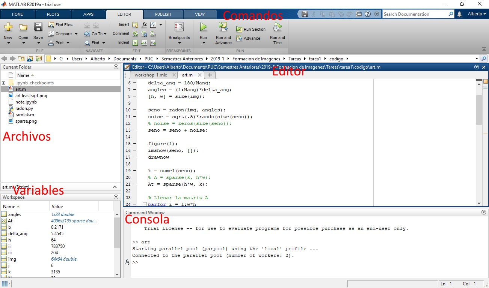
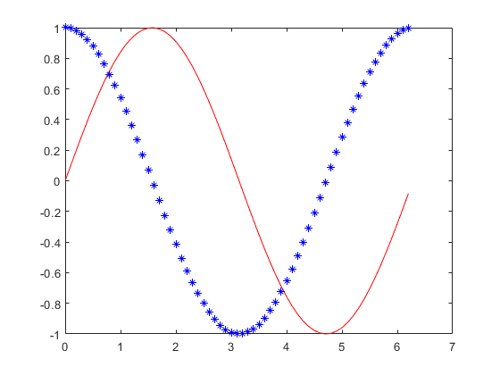
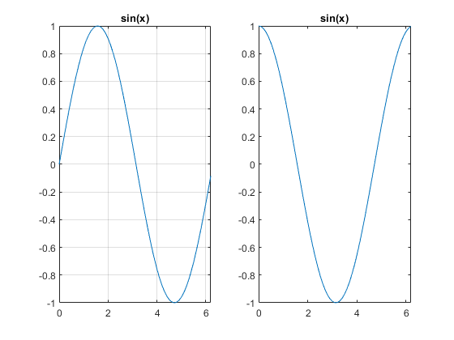

MatLab es un lenguaje de programación especializado en aplicaciones científicas
y de investigación. Es muy utilizado en las escuelas de ingeniería de todo el
mundo para modelar y analizar todo tipo de situaciones. Si eres estudiante o
te interesa trabajar desarrollando algoritmos de punta te recomiendo aprenderlo.
Ademas tiene una gran comunidad y es muy fácil encontrar ejemplos en Internet.

La version oficial la pueden descargar de su pagina [oficial](https://la.mathworks.com/)
o también pueden utilizar [GNU Octave](https://www.gnu.org/software/octave/)
una implementación *open source* que tiene una sintaxis casi completamente
compatible.

# La interfaz

La interfaz de Matlab puede parecer un poco intimidante al principio, pero en
realidad es muy simple y tiene muchas funciones que resultan muy útiles al
desarrollar scripts. En la esquina inferior tenemos una sección de variables
donde se ven información de las variables con las que estamos trabajando. El
panel principal dividido en dos secciones: el editor de *scripts* y la consola.
En el primero podemos escribir programas y ejecutarlos después haciendo click
en el triangulo verde. En la consola podemos escribir comandos que se ejecutaran
cuando apretemos enter, util para probar ideas rápidas y cortas.



# Operaciones basicas y creacion de variables

Ya revisada la interfaz, comencemos con algunos comandos básicos. Te recomiendo
que los vayas ejecutando mientras lo leas e intentes modificarlos para que lo
puedas aprender mejor.

Crear una variable es muy similar a otros lenguajes

```matlab
% Esto es un comentario para que pueda entender mejor
% el codigo
num = 3
str = 'una palabra'
```
<pre>
num = 3
str = 'una palabra'
</pre>

El punto fuerte de Matlab es el manejo de vectores y arreglos. Estos se definen
con corchetes cuadrados, separando las columnas con espacios y las filas con
punto y coma (`;`).

```matlab
% Vectores columna
b = [5; 6]
x = [3; 5]
% Matrices
A = [2 3; 5 6]
D = [2 0; 0 2]
```
<pre>
b = 2×1
     5
     6
x = 2×1
     3
     5
A = 2×2
     2     3
     5     6
D = 2×2
     2     0
     0     2

</pre>

Manipular matices es muy similar a la notación matemática estándar. El producto
matricial o producto punto se calcula usando `*`, mientras que el una
multiplicacion punto a punto se escribe con `.*`. En general las operaciones se
realizan en orden fila columna como en algebra mientras que anteponer un punto
se realiza punto a punto.

```matlab
A' % Transponer la matriz A
ans = 2×2
     2     5
     3     6
A*D
ans = 2×2
     4     6
    10    12
A.*D
ans = 2×2
     4     0
     0    12
A^num
% equivalente a A*A*A
ans = 2×2
   158   201
   335   426
A.^num
% equivalente a (a_ij)*(a_ij)*(a_ij) para cada elemento a_ij de la matriz A
ans = 2×2
     8    27
   125   216
x + b
ans = 2×1
     8
    11
x'*b
ans = 45
```

Aplicando lo que hemos hecho hasta ahora para resolvamos el sistema $Ax = b$

```matlab
x = inv(A)*b
x = 2×1
   -4.0000
    4.3333
A*x - b
ans = 2×1
10-14 ×
    0.4441
    0.8882
% Mas eficiente
x = A\b
x = 2×1
   -4.0000
    4.3333
```

Por supuesto las funciones y constantes matemáticas importantes están
incorporadas.

```matlab
tau = 2*pi
tau = 6.2832
e = exp(1)
e = 2.7183
sin(0.24*tau)
ans = 0.9980
log(e^2) % logaritmo natural
ans = 2.0000
exp(1i*pi) + 1
ans = 0.0000e+00 + 1.2246e-16i
```

# Indices


Para referirse a un elemento de un vector se usan los paréntesis redondos
`()`. A diferencia de la mayoría de los lenguajes de computación en matlab los
indices comienzan en 1 en lugar de 0. También se pueden separar con comas los
indices de la fila y columnas para elegir un elemento en una posición especifica
del arreglo.

```matlab
x(1)
ans = -4.0000
x(2)
ans = 4.3333
A(1, 2)
ans = 3
```
El operador `:` permite establecer un rango o todos los elementos de esa
dimension. Esta es una de las funciones más poderosas del lenguaje permite
simplificar muchas expresiones.

```matlab
Id = eye(3); % matriz identidad de 3x3, equivalente a Id = [1 0 0; 0 1 0; 0 0 1]
Id = 3×3
     1     0     0
     0     1     0
     0     0     1
Id(:, 1)
ans = 3×1
     1
     0
     0
Id(1:2, 2)
ans = 2×1
     0
     1
```
El mismo símbolo también nos sirve para crear un rango de datos.

```matlab
R = 1:40
R = 1×40
     1     2     3     4     5     6     7     8     9    10    11    12    13    14    15    16    17    18    19    20    21    22    23    24    25    26    27    28    29    30    31    32    33    34    35    36    37    38    39    40
Y = 1:0.1:40 % inicio:delta:fin
Y = 1×391
    1.0000    1.1000    1.2000    1.3000    1.4000    1.5000    1.6000    1.7000    1.8000    1.9000    2.0000    2.1000    2.2000    2.3000    2.4000    2.5000    2.6000    2.7000    2.8000    2.9000    3.0000    3.1000    3.2000    3.3000    3.4000    3.5000    3.6000    3.7000    3.8000    3.9000    4.0000    4.1000    4.2000    4.3000    4.4000    4.5000    4.6000    4.7000    4.8000    4.9000    5.0000    5.1000    5.2000    5.3000    5.4000    5.5000    5.6000    5.7000    5.8000    5.9000
```

# Gráficos

En Matlab es muy sencillo hacer todo tipo de gráficos. Revisa la ayuda para ver
todas las opciones de ploteo disponibles

```matlab
x = 0:0.1:tau;
plot(x, sin(x), 'r-');
hold on
plot(x, cos(x), 'b*')
```



También podemos crear varios ejes en una misma figura usando `subplot()`

```matlab
subplot(1, 2, 1)
plot(x, sin(x))
title('sin(x)')
grid()
subplot(1, 2, 2)
plot(x, cos(x))
title('sin(x)')
```



# Ayuda

Una de las mayores ventajas que tiene Matalab es su excelente documentación y
una gran comunidad de usuarios. Para buscar en la ayuda oficial pueden escribir
el buscador de la esquina izquierda o presionar F1 sobre una función para
obtener ayuda. Si no logran resolverlo con la ayuda oficial pueden usar google
y seguramente alguien ya lo pregunto en *stackoverflow* o en los foros de Matlab

# Ejercicio

Grafique la trayectoria de una partícula lanzada desde el piso con velocidad
inicial $v_0 = 10$ y $50^{\circ}$ de inclinación. ¿En que momento alcanza
su altura maxima? **Hint**: recuerde que la trayectoria de una partícula esta
dada por $\{ x_0 + v_{x0} t, y_0 + v_{y0} - \frac{1}{2} gt^2 \}$, y el tiempo
total de vuelo es $t_f = 2 \frac{v_{y0}}{g}$.

[Respuesta](../assets/posts/intro-matlab/respuesta.m)